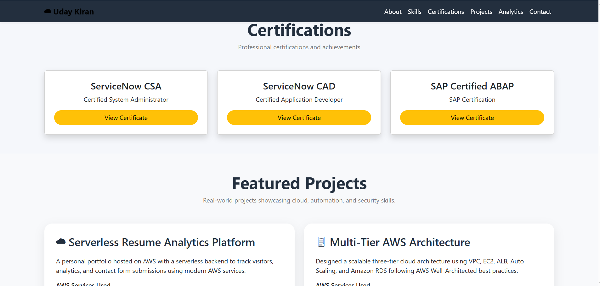
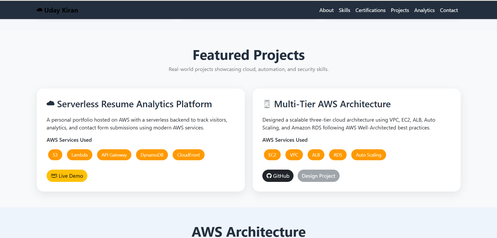
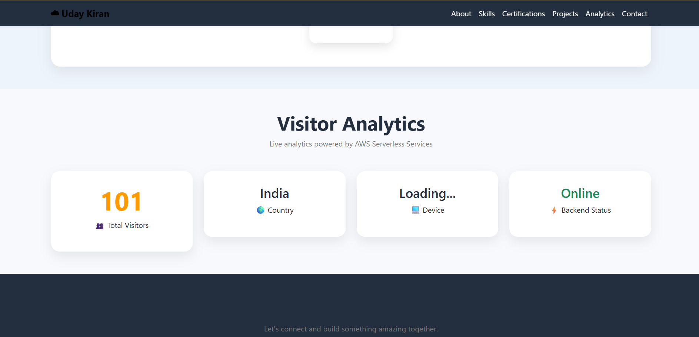
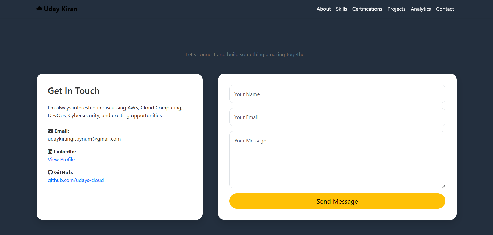

# 🚀 Serverless Resume Analytics Platform

> A serverless resume portfolio and analytics platform built and deployed using AWS.

## 📌 Project Overview

This project is a serverless personal portfolio and resume analytics platform built using AWS.

It demonstrates:

- 🌐 Static website hosting
- 👥 Visitor analytics
- 📊 Visitor counting
- 📩 Contact form processing
- 📧 Email notifications
- 🔐 HTTPS delivery
- ☁️ Serverless backend architecture
- ⚙️ Automated deployment using GitHub Actions

---

# 📸 Project Demo

## 🌐 Portfolio Website

### Home Page


### About / Resume Section


### Skills / Certifications


### Projects Section



### Contact Section



### Visitor Analytics



### Additional Portfolio View



---

# 🏗️ AWS Architecture

```text
                         Visitor
                            │
                            ▼
                    Amazon CloudFront
                            │
                            ▼
                       Amazon S3
                     Static Website
                            │
                            ▼
                       JavaScript
                            │
                  ┌─────────┴─────────┐
                  │                   │
                  ▼                   ▼
             API Gateway         API Gateway
             Visitor API         Contact API
                  │                   │
                  ▼                   ▼
               Lambda              Lambda
                  │                   │
                  ▼                   ▼
             DynamoDB             DynamoDB
              Visitor             Messages
                                      │
                                      ▼
                                  Amazon SES
