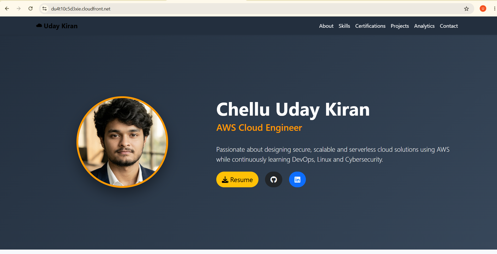
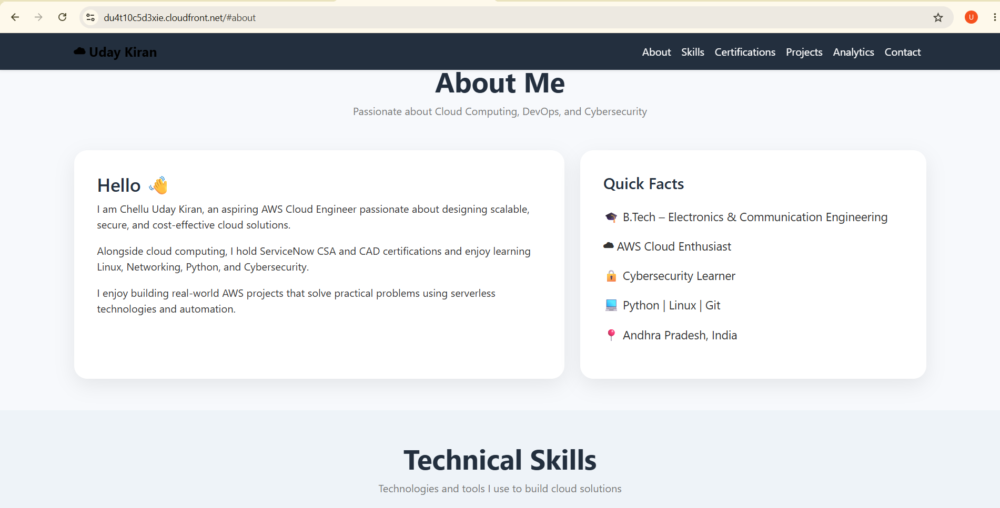
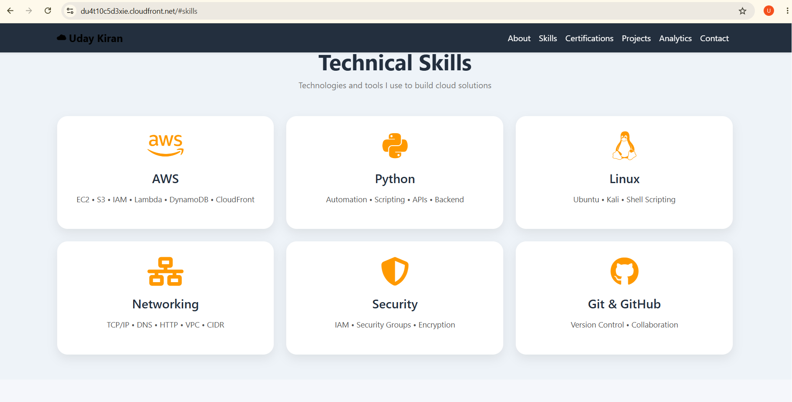

# 🚀 Serverless Resume Analytics Platform

> A serverless resume portfolio and analytics platform built and deployed using AWS.

## 📸 Project Demo

This project demonstrates a serverless personal portfolio with visitor analytics, contact form processing, email notifications, and automated deployment.

### 🌐 Portfolio Website







---

## 🏗️ AWS Architecture


### Architecture Flow

```text
                         Visitor
                            │
                            ▼
                    Amazon CloudFront
                            │
                            ▼
                       Amazon S3
                     Static Website
                            │
                            ▼
                       JavaScript
                            │
                  ┌─────────┴─────────┐
                  │                   │
                  ▼                   ▼
             API Gateway         API Gateway
             Visitor API         Contact API
                  │                   │
                  ▼                   ▼
               Lambda              Lambda
                  │                   │
                  ▼                   ▼
             DynamoDB             DynamoDB
              Visitor             Messages
                                      │
                                      ▼
                                  Amazon SES

☁️ AWS Services Used
AWS Service	Purpose
Amazon S3	Static website hosting
Amazon CloudFront	CDN and HTTPS
Amazon API Gateway	Backend APIs
AWS Lambda	Serverless backend processing
Amazon DynamoDB	Visitor and contact data storage
Amazon SES	Email notifications
AWS IAM	Access control
Amazon CloudWatch	Monitoring and logs
GitHub Actions	CI/CD deployment
📊 AWS Deployment
Amazon S3

Amazon S3 is used to host the frontend static website files.

Amazon CloudFront

Amazon CloudFront provides content delivery and HTTPS access for the portfolio.

Amazon API Gateway

API Gateway exposes the backend APIs used by the frontend.

AWS Lambda

AWS Lambda handles the serverless backend logic.

Amazon DynamoDB

DynamoDB stores visitor analytics and contact form information.

Amazon SES

Amazon SES is used to send contact form email notifications.

👀 Visitor Analytics

The portfolio includes a serverless visitor counter.

Visitor
   ↓
Portfolio Website
   ↓
JavaScript
   ↓
API Gateway
   ↓
Lambda
   ↓
DynamoDB
   ↓
Visitor Count

The visitor count is stored and updated using Amazon DynamoDB through an AWS Lambda function.

📩 Contact Form

The contact form uses a serverless backend.

Visitor
   ↓
Contact Form
   ↓
API Gateway
   ↓
Lambda
   ↓
DynamoDB
   ↓
Amazon SES
   ↓
Email Notification
🚀 CI/CD Pipeline

The frontend deployment is automated using GitHub Actions.

Developer
    │
    ▼
Git Push
    │
    ▼
GitHub Repository
    │
    ▼
GitHub Actions
    │
    ▼
Amazon S3
    │
    ▼
CloudFront
    │
    ▼
Portfolio Website

🖥️ Project Screenshots
Portfolio

🛠️ Technologies
Frontend
HTML5
CSS3
JavaScript
Bootstrap
Font Awesome
Backend
Python
AWS Lambda
Amazon API Gateway
Amazon DynamoDB
AWS
Amazon S3
Amazon CloudFront
Amazon SES
AWS IAM
Amazon CloudWatch
DevOps
Git
GitHub
GitHub Actions
CI/CD
📁 Repository Structure
Serverless-Resume-Analytics/
│
├── .github/
│   └── workflows/
│       └── deploy.yml
│
├── frontend/
│   ├── assets/
│   ├── index.html
│   ├── script.js
│   └── style.css
│
├── lambda/
│
├── screenshots/
│   ├── api-gateway.png
│   ├── aws-lambda.png
│   ├── cloudfront.png
│   ├── dynamodb.png
│   ├── github-actions.png
│   ├── lambda.png
│   ├── live-website-1.png
│   ├── live-website-2.png
│   ├── live-website-3.png
│   ├── live-website-4.png
│   ├── live-website-5.png
│   ├── live-website-6.png
│   ├── live-website-7.png
│   ├── s3.png
│   ├── ses.png
│   └── ses-2.png
│
├── .gitignore
└── README.md
🔐 Security Considerations
IAM permissions are used to control AWS resources.
HTTPS is provided through CloudFront.
AWS credentials are not stored in the frontend.
GitHub Actions secrets are used for deployment credentials.
Sensitive credentials and secrets are excluded from the repository.

Never commit AWS secret keys, access keys, passwords, tokens, or other sensitive credentials to GitHub.

🎯 Key Learning Outcomes

This project provided hands-on experience with:

Serverless architecture
AWS S3 static website hosting
CloudFront
API Gateway
AWS Lambda
DynamoDB
Amazon SES
IAM
CloudWatch
GitHub Actions
CI/CD
REST API integration
Cloud-based application deployment
👨‍💻 Author
Uday Kiran

Software Development Engineer Aspirant | AWS | Cloud | Cybersecurity

GitHub: udays-cloud
LinkedIn: Uday Kiran
Email: udayskirangitpynum@gmail.com
