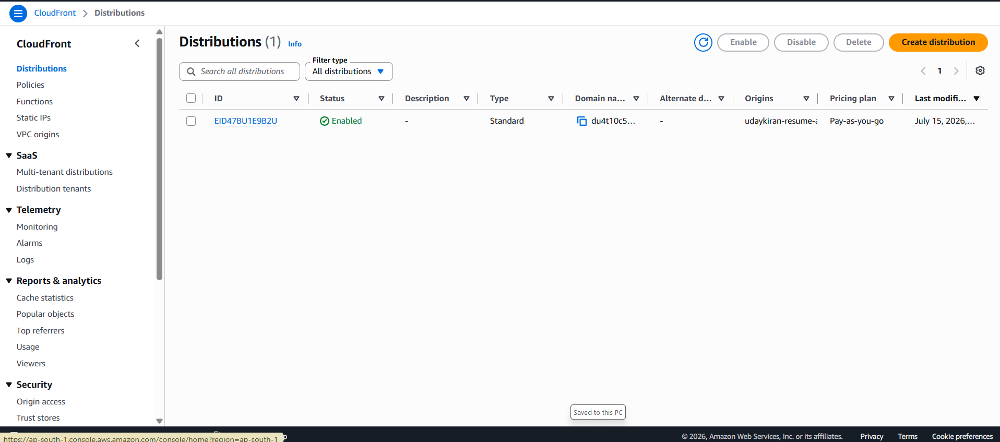
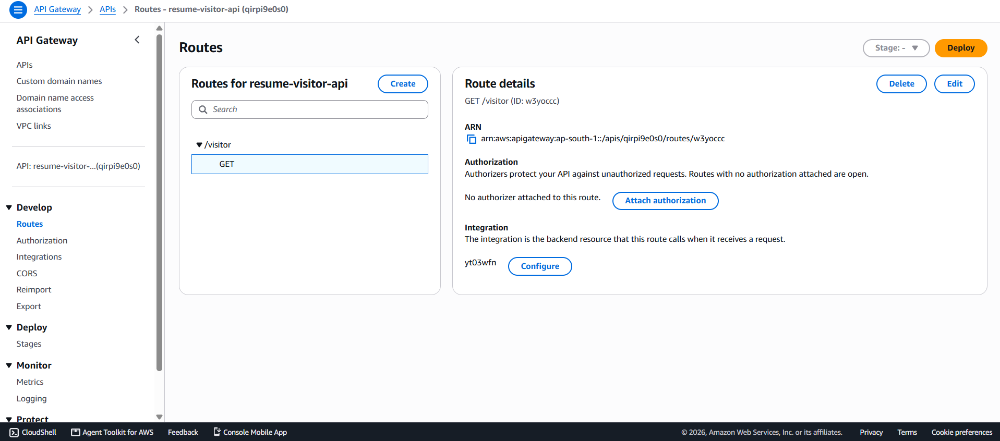
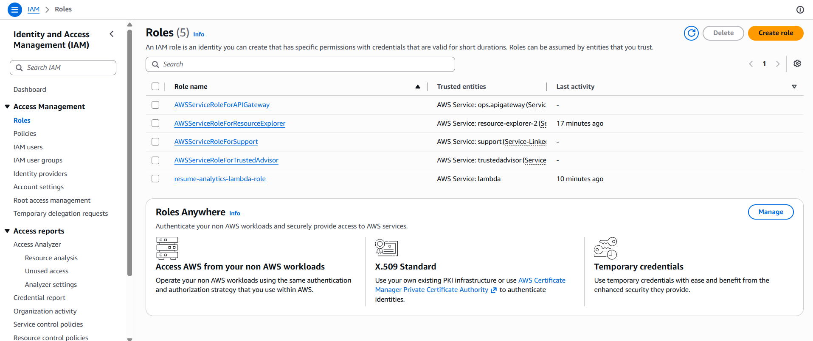
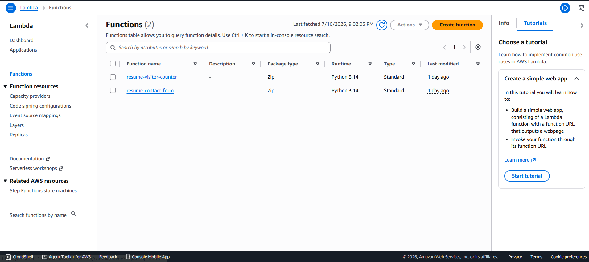
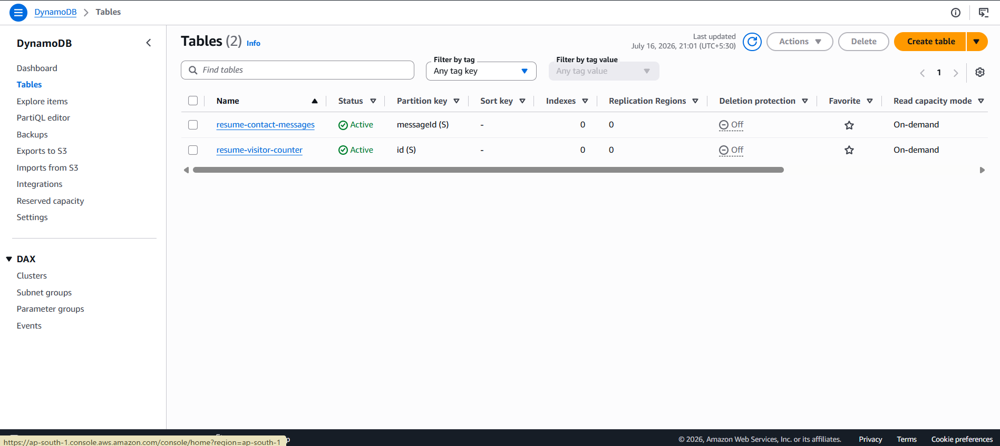
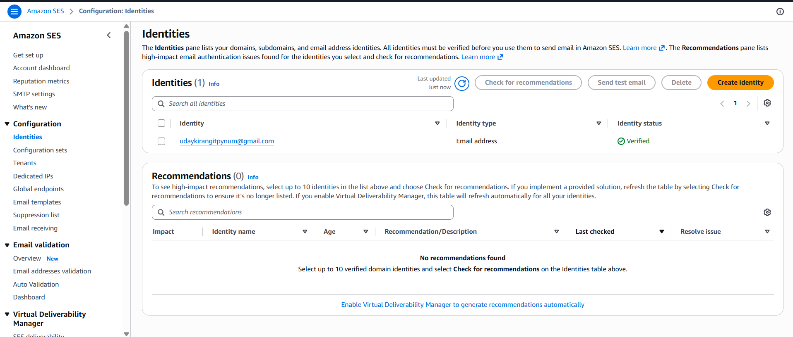

# 🚀 Serverless Resume Analytics Platform

> A serverless resume portfolio and analytics platform built and deployed using AWS.

## 📸 Project Demo

This project demonstrates a serverless personal portfolio with visitor analytics, contact form processing, email notifications, and automated deployment.

### 🌐 Portfolio Website


---

## 🏗️ AWS Architecture

### Architecture Flow

```text
                         Visitor
                            │
                            ▼
                    Amazon CloudFront
                            │
                            ▼
                       Amazon S3
                     Static Website
                            │
                            ▼
                       JavaScript
                            │
                  ┌─────────┴─────────┐
                  │                   │
                  ▼                   ▼
             API Gateway         API Gateway
             Visitor API         Contact API
                  │                   │
                  ▼                   ▼
               Lambda              Lambda
                  │                   │
                  ▼                   ▼
             DynamoDB             DynamoDB
              Visitor             Messages
                                      │
                                      ▼
                                  Amazon SES

## ☁️ AWS Deployment Screenshots

### Amazon S3 — Static Website Hosting


S3 was used to host the static frontend of the resume portfolio.

---

### Amazon CloudFront — CDN & HTTPS




CloudFront provides CDN distribution and HTTPS access for the portfolio.

---

### API Gateway — Visitor Analytics API




API Gateway exposes the serverless backend endpoint used by the portfolio.

---

### AWS Lambda — Serverless Backend




Lambda processes visitor analytics and backend requests without managing servers.

---

### AWS Lambda Configuration



Lambda configuration and deployment details.

---

### Amazon DynamoDB — Data Storage




DynamoDB stores visitor analytics and application data.

---

### Amazon SES — Email Notifications




Amazon SES is used for sending email notifications from the contact form.

---
Software Development Engineer Aspirant | AWS | Cloud | Cybersecurity

GitHub: udays-cloud
LinkedIn: Uday Kiran
Email: udayskirangitpynum@gmail.com
